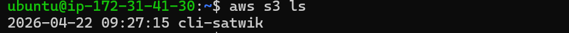
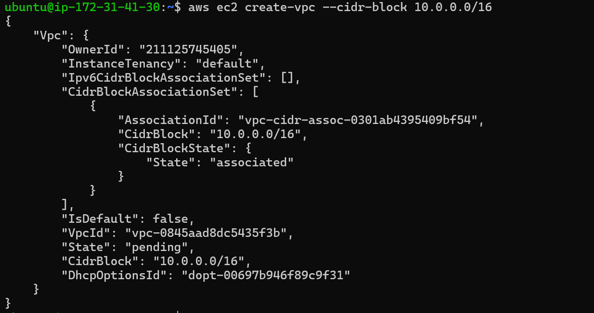

# 🚀 AWS CLI Lab & Documentation (Step-by-Step)

## 📘 Basic Definitions

### 🔹 What is CLI?

A **Command Line Interface (CLI)** is a text-based interface where you interact with a system by typing commands instead of using a graphical interface.

**Example:**

```
ls
```

This command lists files in a directory.

------

### 🔹 What is AWS CLI?

The **AWS CLI (Amazon Web Services Command Line Interface)** is a tool that allows you to manage AWS services directly from your terminal using commands.

It interacts with services like:

- Amazon EC2
- Amazon S3
- Amazon VPC

**Example:**

```
aws s3 ls
```

Lists all S3 buckets in your account.

------

### 🔹 How do we create resources (like VPC) using AWS CLI?

You use AWS CLI commands that directly call AWS APIs.

**Example:**

```
aws ec2 create-vpc --cidr-block 10.0.0.0/16
```

👉 This creates a Virtual Private Cloud (VPC) with a defined IP range.

------

# 🖥️ Part 1: Launch and Prepare EC2 Instance

### Step 1: Launch EC2 Instance

- Go to AWS Console
- Launch a basic instance (Ubuntu recommended)
- Connect using SSH


------

### Step 2: Update the Server

```
sudo apt -y update
```

👉 Updates package lists.

------

### Step 3: Install unzip

```
sudo apt install unzip -y
```

👉 Needed to extract AWS CLI package.

------

### Step 4: Install AWS CLI

```
curl "https://awscli.amazonaws.com/awscli-exe-linux-x86_64.zip" -o "awscliv2.zip"

unzip awscliv2.zip

sudo ./aws/install
```

👉 Installs AWS CLI on your EC2 instance.


------

# 🔐 Part 2: IAM Role Setup

### Step 1: Create IAM Role

- Go to IAM → Roles → Create Role
- Use Case: EC2
- Attach required policy (e.g., S3 Full Access for testing)
- Give role name → Create

👉 IAM Role allows EC2 to access AWS services securely without credentials.


------

### Step 2: Attach Role to EC2

- Go to EC2 → Instance
- Actions → Security → Modify IAM Role
- Attach created role


------

# ☁️ Part 3: Verify AWS CLI Connection

```
aws s3 ls
```

👉 Shows all S3 buckets → confirms CLI is working.



------

# 📦 Part 4: Working with S3

### 🔹 Create Bucket

```
aws s3 mb s3://cli-satwik-bucket-2
```

👉 `mb` = Make Bucket


------

### 🔹 Upload File

```
aws s3 cp awscliv2.zip s3://cli-satwik-bucket-2
```

👉 `cp` = Copy file to S3


------

# 🌐 Part 5: Create VPC Using AWS CLI

## 🔹 Step 1: Create VPC

```
aws ec2 create-vpc --cidr-block 10.0.0.0/16
```

👉 CIDR defines IP range for VPC.




------

## 🔹 Step 2: Tag VPC

```
aws ec2 create-tags \
--resources vpc-xxxx \
--tags Key=Name,Value=Satwik-VPC
```

👉 Adds name to VPC.


------

## 🔹 Step 3: View VPCs

```
aws ec2 describe-vpcs
```


------

# 🌍 Part 6: Create Subnets

### Public Subnets

```
aws ec2 create-subnet \
--vpc-id vpc-xxxx \
--cidr-block 10.0.1.0/24 \
--availability-zone us-east-1a
aws ec2 create-subnet \
--vpc-id vpc-xxxx \
--cidr-block 10.0.2.0/24 \
--availability-zone us-east-1b
```


------

### Private Subnets

```
aws ec2 create-subnet \
--vpc-id vpc-xxxx \
--cidr-block 10.0.3.0/24 \
--availability-zone us-east-1a
aws ec2 create-subnet \
--vpc-id vpc-xxxx \
--cidr-block 10.0.4.0/24 \
--availability-zone us-east-1b
```

👉 Public = internet access
 👉 Private = no direct internet access


------

# 🌐 Part 7: Internet Gateway (IGW)

### Create IGW

```
aws ec2 create-internet-gateway
```


------

### Attach IGW to VPC

```
aws ec2 attach-internet-gateway \
--internet-gateway-id igw-xxxx \
--vpc-id vpc-xxxx
```


------

# 🛣️ Part 8: Route Tables

### Public Route Table

```
aws ec2 create-route-table --vpc-id vpc-xxxx
```


------

### Add Internet Route

```
aws ec2 create-route \
--route-table-id rtb-xxxx \
--destination-cidr-block 0.0.0.0/0 \
--gateway-id igw-xxxx
```


------

### Associate with Public Subnets

```
aws ec2 associate-route-table \
--subnet-id subnet-xxxx \
--route-table-id rtb-xxxx
```

.png)

------

### Private Route Table

```
aws ec2 create-route-table --vpc-id vpc-xxxx
```

👉 No internet route added.


------

# 🔒 Part 9: Network ACL (NACL)

### Create NACL

```
aws ec2 create-network-acl --vpc-id vpc-xxxx
```
.png)


------

### Inbound Rule (Allow HTTP)

```
aws ec2 create-network-acl-entry \
--network-acl-id acl-xxxx \
--rule-number 100 \
--protocol tcp \
--port-range From=80,To=80 \
--cidr-block 0.0.0.0/0 \
--rule-action allow \
--ingress
```

------

### Outbound Rule

```
aws ec2 create-network-acl-entry \
--network-acl-id acl-xxxx \
--rule-number 100 \
--protocol -1 \
--cidr-block 0.0.0.0/0 \
--rule-action allow \
--egress
```

------

# 🛡️ Part 10: Security Group (SG)

### Create Security Group

```
aws ec2 create-security-group \
--group-name my-sg \
--description "My Security Group" \
--vpc-id vpc-xxxx
```


------

### Allow HTTP

```
aws ec2 authorize-security-group-ingress \
--group-id sg-xxxx \
--protocol tcp \
--port 80 \
--cidr 0.0.0.0/0
```
.png)


------

### Allow SSH

```
aws ec2 authorize-security-group-ingress \
--group-id sg-xxxx \
--protocol tcp \
--port 22 \
--cidr 0.0.0.0/0
```


------

# 📌 Summary

By completing this lab, you have:

- Installed AWS CLI
- Connected EC2 to AWS services
- Created and managed S3 buckets
- Built a full VPC network using CLI
- Configured:
  - Subnets
  - Internet Gateway
  - Route Tables
  - NACL
  - Security Groups
